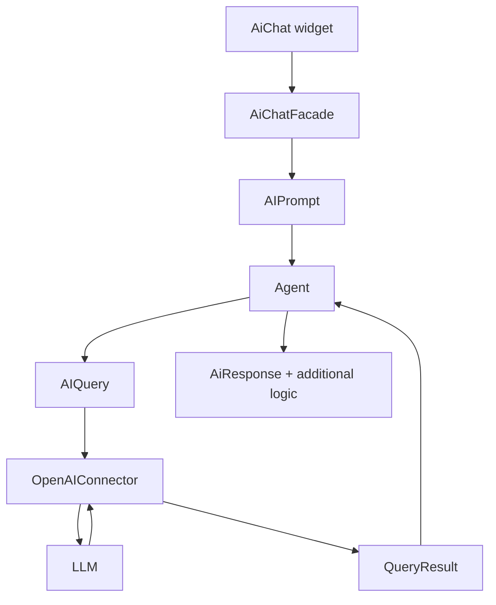

The app `axenox.GenAI` adds the possibility to configure AI agents, as 
integral parts of our apps. It provides a framework to develop, monitor and 
test these agents. The goal is to let app designers add agents to their apps 
easily and gradually improve them over time based on information collected 
by the app about their use and efficiency.

This apps adds the `Administration > AI` menu with a convenient user 
interface to create, test and monitor agents.

## AI components

The AI framework consists of these main compinents:

- At its heart, agents having a prototype and a UXON model handle prompts 
  (similar to action tasks) and return `AIPromptResult` containers - 
  comparable to task results for actions. Results mostly contain a response 
  message from the LLM, but can also include other things like a DataSheet 
  filled by the LLM.
- AI Tools can be called by an LLM. Tools are configured in the agents UXON 
  by specifying a tool prototype and a model for the tool. Tool prototypes can be easily added to any app.
- AI concepts are configurable placeholders in the agents instructions. Each 
  concept also has a prototype and a model. Concept prototypes are easy to 
  add to apps too. In fact, using the `ToolCallConcept`, you can include any 
  tool output in the instructions right away.

Messages exchanged with LLMs are tracked in Ai conversations. A complete and 
easy to read conversation log is very important for the continuous 
development of really helpful agents. A conversation stores all data 
exchanged with the LLM.

Conversations can be rated by users and admins to support continuous 
improvement of agents.

## Data flow

The archetecture aims to decouple different layers and stay as vendor in
dependent as possible.  The core entity is the AIPrompt, which is based on
an HttpTask and, thus, can be handled by facades, actions and agents.

In the case of a chat interface, the flow is as follows:

1. The AiChat widget sends an AJAX request, which is transformed to an 
   AIPrompt by the `\axenox\GenAI\Facades\AiChatFacade`. The facade 
   will also determine the agent being addressed, and call `Agent::handle
   ($prompt)`. The agent gets all required information through the prompt - 
   not only the user message, but also information about the environment: 
   where was the chat, what data was selected next to it, etc.
2. The agent uses the prompt to render its instructions (e.g. include 
   selected data in a concept), prepare the tools, etc.
3. The result is placed in a DataQuery instance and passed to the Ai 
   connector selected for the agent. In contrast to regular data sources, 
   agents do not use query builders.
4. The connector transforms the internal DataQuery into a vendor specific  
   HTTP requests and sends it to the LLM.
5. The connector also interprets the response and calculates the costs. Then 
   int fills the DataQuery with results and passes it back to the agent.

Similarly to a task, an AI prompt can also be knstantiated via code - e.g. 
in an action. See `axenox/genai/Actions/RunTest.php` for an example.

## Agents and their prototypes

Each agent is defined by a prototype class (implementing 
`TODO\AiAgentIntefrface`), Markdown instructions and a UXON model. The 
`axenox/genai/AI/Agents/GenericAssistant.php` is the default staring point 
for a generic chat assistant. Other prototypes focus on additional features 
like the metamodel-aware ImportAgent, the Sql specialize 
`axenox/ide/AI/Agents/SqlAssistant.php`, etc. Custom prototypes can be 
included in any app in the `AI/Agents` subfolder.

Custom agent prototypes allow to add logic "around" the agent - e.g. extract 
more data from the Ai prompt.

## Instructions

What exactly an Agent is supposed to do is defined it it's model mainly by 
writing instructions and configuring tools. Both can be customized: 
instructions can contain placeholders for [AI concepts](instructions/Ai-concept.instructions.md), 
while [tools](instructions/Ai-tools.instructions.md) are based on prototypes 
and can be fine-tuned for every agent specifically.