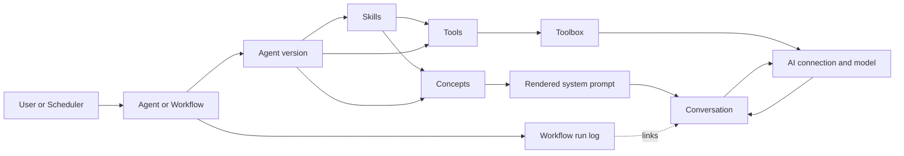
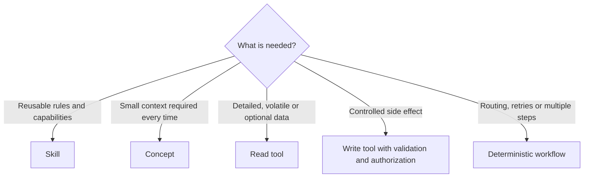
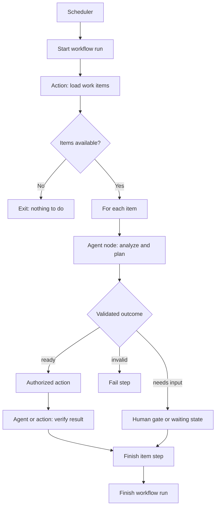

# Developer architecture

[Deutsch](../../Translations/de/AI/Developer/index.md)

This page defines the responsibility boundaries of the GenAI building blocks. The detail pages document their concrete configuration and available prototypes.

## Architecture at a glance

| Element | Responsibility | Should | Should not |
| --- | --- | --- | --- |
| Agent | Process a prompt within one defined role | Assemble instructions and context, expose tools, invoke the model, and validate responses | Own schedules, global workflow routing, or conversations of other agents |
| Agent version | Preserve one reproducible executable agent configuration | Define prototype, instructions, connection, skills, concepts, tools, and response schema | Change unnoticed during an active conversation |
| Prompt | Carry the current input and runtime context | Provide user text, input data, page, metaobject, and conversation UID | Own durable state or workflow progress |
| Conversation | Persist an ordered exchange between one individual participant and one agent version | Store system, user, tool, assistant, warning, and error messages | Mix several agents or agent versions in one conversation |
| Skill | Package a reusable domain capability | Combine instructions, concepts, and tools for assignment to agent versions | Execute independently, plan, or own conversation state |
| Concept | Produce required context while building the system prompt | Render small, relevant, mostly stable information automatically | Load large or rarely needed data into every prompt |
| Tool | Perform one bounded operation on demand | Validate arguments, read data or perform authorized side effects, and return structured results | Control the overall workflow, bypass permissions, or expose unrestricted operations |
| Toolbox | Combine tools visible to an agent | Register tools from agents, skills, and concepts and expose naming conflicts | Decide domain ordering or workflow routes |
| AI connection / model | Encapsulate technical model access | Transfer queries and return model responses and usage metadata | Define the agent role, permissions, or persistence |
| Autonomous configuration | Start an agent repeatedly through a scheduler | Associate agent, app, scheduler, description, and flow diagram and support enable/disable | Replace a general workflow engine or a second agent definition |
| Agentic workflow | Orchestrate multiple deterministic steps | Execute actions and agents, validate, route, log, retry, and wait when required | Let an LLM choose arbitrary operations, permissions, or transitions |
| Workflow run log | Keep an autonomous run auditable | Store run and step status, order, duration, outcome, errors, and child conversation | Duplicate complete prompts, large artifacts, or agent messages |
| Power UI action | Form the authorized execution boundary of a workflow step | Retain task validation, authorization, transactions, and standardized results | Be bypassed by direct calls to protected implementation methods |



## Agent and agent version

`AI_AGENT` is the stable domain identity. `AI_AGENT_VERSION` is the executable configuration. A version determines the prototype, model connection, instructions, `CONFIG_UXON`, skills, and response schema.

An agent should:

- have one bounded role;
- turn input into system and user context;
- receive only tools required for that role;
- validate structured output when downstream logic depends on it;
- make errors, warnings, tool calls, and responses observable in its conversation.

An agent should not:

- simulate scheduler or retry logic in its prompt;
- elevate its own permissions;
- use unvalidated model text directly as a workflow transition or side effect;
- continue a conversation belonging to another agent version.

Behavior changes that must remain traceable belong in a new agent version. An active conversation remains assigned to its original version.

## Prompt and conversation

A prompt is short-lived input. A conversation is the durable ordered history. It belongs to exactly one individual participant and one agent version. The participant is usually a user, but in orchestrated execution it can also be another agent or its workflow.

An initialized conversation has exactly one immutable system prompt. The agent calls `renderSystemPrompt()` and persists its string result only when no system prompt exists. Otherwise, it loads the persisted prompt. This branch prevents later configuration changes from retroactively changing the context of an active conversation.

```mermaid
sequenceDiagram
    actor Participant as User or orchestrator
    participant Agent
    participant Factory as AiFactory
    participant Conversation
    participant Model
    participant Tool

    Participant->>Agent: Prompt
    Agent->>Factory: Create with query UID or restore by UID
    Factory-->>Agent: AiConversation
    Conversation->>Conversation: Load and validate assignment lazily
    alt System prompt exists
        Agent->>Conversation: Load immutable system prompt
        Conversation-->>Agent: Persisted system-prompt string
    else No system prompt exists
        Agent->>Agent: renderSystemPrompt(prompt)
        Agent->>Conversation: Save system prompt once
    end
    Agent->>Conversation: Save user prompt and set initial title
    Agent->>Model: Instructions, history and tools
    opt Model requests a tool
        Model->>Agent: Tool call
        Agent->>Tool: Validated invocation
        Tool-->>Agent: Result or exception
        Agent->>Conversation: Save tool call and result
        Agent->>Model: Tool result
    end
    Model-->>Agent: Final response
    Agent->>Conversation: Save response
    Agent-->>Participant: AiResponse
```

Message content is stored as a string while additional structured data is stored in `AI_MESSAGE.DATA`. See the [conversation documentation](../Conversations/index.md) for immutable agent assignment details.

Runtime components depend on interfaces wherever possible. In particular, `AiConversation` receives an `AiAgentInterface` instead of a concrete agent prototype and does not retain a request-bound prompt. The conversation lazily loads its next message sequence through `getSequenceNumber()` and advances it centrally through `incrementSequenceNumber()`.

## Skills, concepts, and tools

These elements solve different problems and are not interchangeable.

### Skill

A skill is a reusable capability package. It can contain instructions, concepts, nested skills, and tools. It is assigned to an agent version and extends its behavior, but does not execute a run itself.

Use a skill when several agents need the same domain rules and tools, such as analyzing ExFace pages or classifying support tickets.

### Concept

A concept is rendered automatically while building the system prompt. Use it for context required by every applicable request: mandatory rules, a compact app introduction, a small schema, or information derived from input.

Keep concepts small. Large, volatile, or rarely needed data belongs behind a tool so network, compute, and token costs occur only when needed.

### Tool

A tool is invoked only when the model or controlling agent needs the operation. A good tool has one task, a narrow argument schema, limited permissions, and a structured result. Mutating tools must validate input and retain normal ExFace authorization and transaction behavior.



Example: an "Invoice review" skill contains review instructions, a concept with mandatory approval rules, and a tool that loads one invoice on demand. The tool does not decide approval by itself; the agent or workflow validates the result against declared outcomes.

## Autonomous execution

### `AI_AUTONOMOUS`: scheduled agent execution

`AI_AUTONOMOUS` associates an agent with an app and scheduler. Its description and flow diagram document the scheduled run. `Turn ON` and `Turn OFF` enable or disable the underlying scheduler through customizing.

This configuration answers **when** and **which agent** is started. It does not automatically define multi-step routing, retries, human gates, or idempotent side effects. Those requirements belong in an agentic workflow.

### Agentic workflow: controlled orchestration

A workflow separates deterministic control from probabilistic agent work:

- The workflow chooses steps, transitions, limits, retries, and permission boundaries.
- An agent handles only the bounded task of its agent node.
- Power UI actions remain the execution boundary for authorized operations.
- Model responses may route execution only through declared and validated outcomes.
- Every agent node creates its own conversation for its exact agent version.
- The workflow run provides the parent timeline and links child conversations.



The existing `WorkflowRunLog` persists runs and ordered steps including status, outcome, duration, errors, and an optional child conversation. A general configurable workflow engine with definitions, graph validation, waiting, and human gates remains target architecture; its status is documented in the [agentic workflow roadmap](../../Roadmap/Agentic_workflows.md).

## Implementation rules

1. Give every agent one bounded domain role.
2. Version changes to instructions, tools, skills, concepts, or response contracts when existing runs must remain reproducible.
3. Use concepts only for context needed automatically and regularly.
4. Use tools for optional data and bounded operations.
5. Validate tool arguments and structured model responses before use.
6. Let schedulers start; let workflows route and retry.
7. Perform side effects through authorized actions or narrowly scoped tools.
8. Use a separate conversation for every agent version.
9. Store large results as artifacts or source data and link them instead of duplicating them in run logs.
10. Record technical failures separately from domain outcomes.

## Detailed references

- [Agents](../Agents/index.md)
- [Prompting](../Agents/prompting.md)
- [Conversations](../Conversations/index.md)
- [Skills](../Skills/index.md)
- [Tools](../Tools/index.md)
- [Concepts](../Concepts/index.md)
- [Agentic workflow roadmap](../../Roadmap/Agentic_workflows.md)
