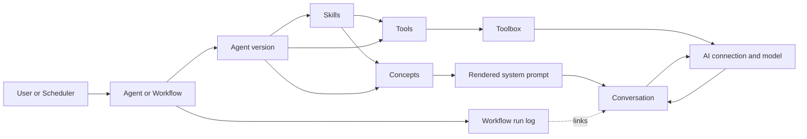
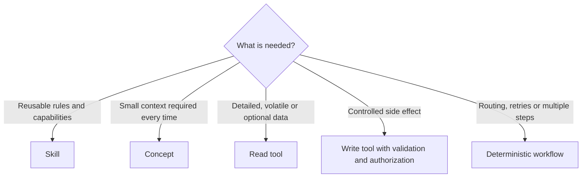
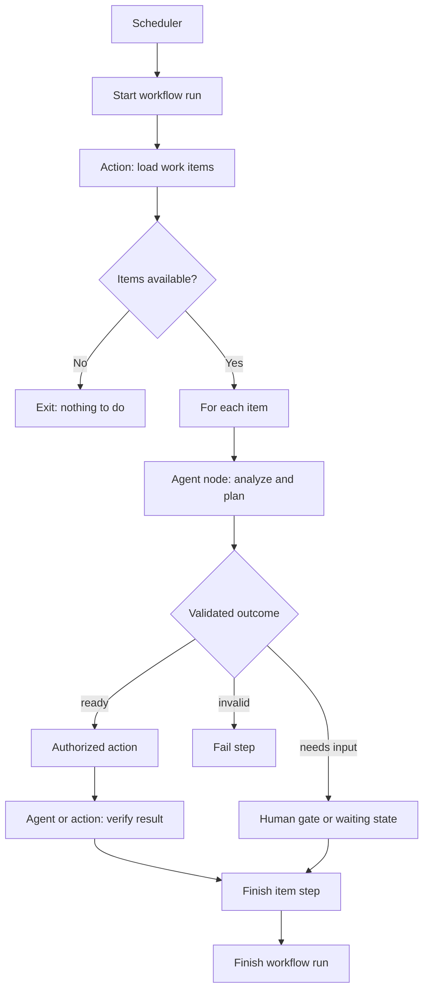

# Developer-Architektur

[English](index.md)

Diese Seite beschreibt die Verantwortungsgrenzen der GenAI-Bausteine. Die Detailseiten dokumentieren deren konkrete Konfiguration und vorhandene Prototypen.

## Architektur auf einen Blick

| Element | Aufgabe | Soll können | Soll nicht |
| --- | --- | --- | --- |
| Agent | Einen Prompt mit einer definierten Rolle bearbeiten | Instructions und Kontext zusammenführen, Tools anbieten, das Modell aufrufen und Antworten validieren | Zeitpläne, globale Workflow-Routen oder fremde Conversations verwalten |
| Agent-Version | Eine reproduzierbare ausführbare Agent-Konfiguration festhalten | Prototyp, Instructions, Verbindung, Skills, Concepts, Tools und Antwortschema eindeutig bestimmen | Während einer laufenden Conversation unbemerkt wechseln |
| Prompt | Die aktuelle Eingabe und ihren Laufzeitkontext transportieren | User-Text, Eingabedaten, Seite, Metaobjekt und Conversation-UID bereitstellen | Langfristigen Zustand oder Workflow-Fortschritt besitzen |
| Conversation | Den geordneten Austausch zwischen einem individuellen Teilnehmer und einer Agent-Version persistieren | System-, User-, Tool-, Assistant-, Warning- und Error-Nachrichten nachvollziehbar speichern | Mehrere Agenten oder Agent-Versionen in derselben Conversation mischen |
| Skill | Wiederverwendbare fachliche Fähigkeit paketieren | Instructions, Concepts und Tools kombinieren und einer Agent-Version zugeordnet werden | Selbstständig laufen, planen oder Conversation-Zustand besitzen |
| Concept | Erforderlichen Kontext beim Aufbau des System-Prompts erzeugen | Kleine, relevante und möglichst stabile Informationen automatisch rendern | Große oder selten benötigte Daten ungefragt in jeden Prompt laden |
| Tool | Eine klar begrenzte Operation auf Anforderung ausführen | Validierte Argumente verarbeiten, lesen oder autorisierte Seiteneffekte ausführen und strukturierte Ergebnisse liefern | Den Gesamtworkflow steuern, Berechtigungen umgehen oder unbegrenzte Aktionen anbieten |
| Toolbox | Die für einen Agenten sichtbaren Tools zusammenführen | Tools aus Agent, Skills und Concepts registrieren und Namenskonflikte sichtbar machen | Fachliche Reihenfolgen oder Routing-Entscheidungen treffen |
| KI-Verbindung / Modell | Den technischen Zugriff auf ein Modell kapseln | Queries übertragen, Modellantworten und Nutzungsmetadaten liefern | Fachliche Agentenrolle, Berechtigungen oder Persistenz definieren |
| Autonomous-Konfiguration | Einen Agenten über einen Scheduler wiederkehrend starten | Agent, App, Scheduler, Beschreibung und Ablaufdiagramm zuordnen sowie Ausführung aktivieren/deaktivieren | Eine allgemeine Workflow-Engine oder eine zweite Agent-Definition ersetzen |
| Agentischer Workflow | Mehrere deterministische Schritte orchestrieren | Aktionen und Agenten ausführen, Ergebnisse validieren, routen, protokollieren, wiederholen und gegebenenfalls warten | Einem LLM freie Wahl über beliebige Aktionen, Rechte oder Übergänge geben |
| Workflow-Run-Log | Einen autonomen Ablauf auditierbar protokollieren | Run- und Step-Status, Reihenfolge, Dauer, Outcome, Fehler und Child-Conversation speichern | Vollständige Prompts, große Artefakte oder Agentennachrichten duplizieren |
| Power-UI-Action | Die autorisierte Ausführungsgrenze eines Workflow-Schritts bilden | Task-Validierung, Berechtigungen, Transaktionen und standardisierte Ergebnisse nutzen | Durch direkte Aufrufe geschützter Implementierungsmethoden umgangen werden |



## Agent und Agent-Version

`AI_AGENT` ist die stabile fachliche Identität. `AI_AGENT_VERSION` ist die konkrete ausführbare Konfiguration. Eine Version legt insbesondere Prototyp, Modellverbindung, Instructions, `CONFIG_UXON`, Skills und Antwortschema fest.

Ein Agent soll:

- genau eine begrenzte Rolle besitzen;
- Eingaben in einen System- und User-Kontext überführen;
- nur die für diese Rolle erforderlichen Tools erhalten;
- strukturierte Ausgaben gegen ein Schema validieren, wenn nachgelagerte Logik darauf basiert;
- Fehler, Warnungen, Toolaufrufe und Antworten in seiner Conversation erfassbar machen.

Ein Agent soll nicht:

- technische Scheduler- oder Retry-Logik im Prompt simulieren;
- selbst Berechtigungen erweitern;
- unvalidierte Modelltexte direkt als Workflow-Übergang oder Seiteneffekt verwenden;
- eine bestehende Conversation einer anderen Agent-Version fortsetzen.

Verhaltensänderungen, die nachvollziehbar bleiben müssen, gehören in eine neue Agent-Version. Eine laufende Conversation bleibt ihrer ursprünglichen Version zugeordnet.

## Prompt und Conversation

Der Prompt ist ein kurzlebiges Eingabeobjekt. Die Conversation ist der dauerhafte, geordnete Verlauf. Eine Conversation gehört genau einem individuellen Teilnehmer und genau einer Agent-Version. Der Teilnehmer ist meistens ein Benutzer, kann in orchestrierten Abläufen aber auch ein anderer Agent beziehungsweise dessen Workflow sein.

Eine initialisierte Conversation besitzt exakt einen unveränderlichen System-Prompt. Nur wenn noch keiner vorhanden ist, ruft der Agent `renderSystemPrompt()` auf und speichert dessen String-Ergebnis. Andernfalls lädt er den persistierten Prompt. Diese Verzweigung verhindert, dass spätere Konfigurationsänderungen den Kontext eines laufenden Gesprächs rückwirkend verändern.

```mermaid
sequenceDiagram
    actor Participant as User or orchestrator
    participant Agent
    participant Factory as AiFactory
    participant Conversation
    participant Model
    participant Tool

    Participant->>Agent: Prompt
    Agent->>Factory: Create with query UID or restore by UID
    Factory-->>Agent: AiConversation
    Conversation->>Conversation: Load and validate assignment lazily
    alt System prompt exists
        Agent->>Conversation: Load immutable system prompt
        Conversation-->>Agent: Persisted system-prompt string
    else No system prompt exists
        Agent->>Agent: renderSystemPrompt(prompt)
        Agent->>Conversation: Save system prompt once
    end
    Agent->>Conversation: Save user prompt and set initial title
    Agent->>Model: Instructions, history and tools
    opt Model requests a tool
        Model->>Agent: Tool call
        Agent->>Tool: Validated invocation
        Tool-->>Agent: Result or exception
        Agent->>Conversation: Save tool call and result
        Agent->>Model: Tool result
    end
    Model-->>Agent: Final response
    Agent->>Conversation: Save response
    Agent-->>Participant: AiResponse
```

Der Message-Content wird als String gespeichert; zusätzliche strukturierte Daten liegen in `AI_MESSAGE.DATA`. Details zur unveränderlichen Agent-Zuordnung stehen in der [Conversation-Dokumentation](../Conversations/index_german.md).

Runtime-Komponenten hängen nach Möglichkeit von Interfaces ab. Insbesondere erhält `AiConversation` einen `AiAgentInterface` statt eines konkreten Agent-Prototyps und keinen requestgebundenen Prompt. Ihre nächste Message-Sequenznummer lädt die Conversation bei Bedarf selbst über `getSequenceNumber()` und erhöht sie zentral über `incrementSequenceNumber()`.

## Skills, Concepts und Tools

Diese drei Elemente lösen unterschiedliche Probleme und sind nicht austauschbar.

### Skill

Ein Skill ist ein wiederverwendbares Fähigkeitspaket. Er kann Instructions, Concepts, weitere Skills und Tools enthalten. Er wird einer Agent-Version zugeordnet und erweitert deren Verhalten, führt aber selbst keinen Lauf aus.

Ein Skill eignet sich, wenn mehrere Agenten dieselben fachlichen Regeln und Werkzeuge benötigen, beispielsweise „ExFace-Seiten analysieren“ oder „Support-Tickets klassifizieren“.

### Concept

Ein Concept wird beim Aufbau des System-Prompts automatisch gerendert. Es eignet sich für Kontext, der in jeder betroffenen Anfrage benötigt wird: verbindliche Regeln, eine kompakte App-Einführung, ein kleines Schema oder aus der Eingabe abgeleitete Informationen.

Concepts sollen sparsam bleiben. Große, volatile oder selten benötigte Daten gehören hinter ein Tool, damit Netzwerk-, Rechen- und Tokenaufwand nur bei Bedarf entstehen.

### Tool

Ein Tool wird nur aufgerufen, wenn das Modell oder der kontrollierende Agent die Operation benötigt. Ein gutes Tool hat eine Aufgabe, ein enges Argumentschema, begrenzte Rechte und ein strukturiertes Ergebnis. Schreibende Tools müssen Eingaben validieren und normale ExFace-Berechtigungen sowie Transaktionen respektieren.



Beispiel: Ein Skill „Invoice review“ enthält Prüfanweisungen, ein Concept mit den verbindlichen Freigaberegeln und ein Tool zum bedarfsgesteuerten Laden einer konkreten Rechnung. Das Tool entscheidet nicht selbst über die Freigabe; Agent oder Workflow validieren das Ergebnis gegen die erlaubten Outcomes.

## Autonome Ausführung

### `AI_AUTONOMOUS`: geplanter Agentenstart

`AI_AUTONOMOUS` ordnet einen Agenten einer App und einem Scheduler zu. Beschreibung und Ablaufdiagramm dokumentieren den geplanten Lauf. `Turn ON` und `Turn OFF` aktivieren beziehungsweise deaktivieren den zugrunde liegenden Scheduler über Customizing.

Diese Konfiguration beantwortet **wann** und **welcher Agent** gestartet wird. Sie definiert nicht automatisch mehrstufiges Routing, Wiederholungsregeln, Human Gates oder idempotente Seiteneffekte. Solche Anforderungen gehören in einen agentischen Workflow.

### Agentischer Workflow: kontrollierte Orchestrierung

Ein Workflow trennt deterministische Steuerung von probabilistischer Agentenarbeit:

- Der Workflow wählt Schritte, Übergänge, Limits, Retries und Berechtigungsgrenzen.
- Ein Agent bearbeitet nur die begrenzte Aufgabe seines Agent-Nodes.
- Power-UI-Actions bleiben die Ausführungsgrenze für autorisierte Operationen.
- Modellantworten dürfen nur über deklarierte und validierte Outcomes geroutet werden.
- Jeder Agent-Node erzeugt eine eigene Conversation für seine exakte Agent-Version.
- Der Workflow-Run bildet die übergeordnete Timeline und verknüpft Child-Conversations.



Der aktuell vorhandene `WorkflowRunLog` persistiert Runs und geordnete Steps einschließlich Status, Outcome, Dauer, Fehler und optionaler Child-Conversation. Eine allgemeine konfigurierbare Workflow-Engine mit Definitionen, Graphvalidierung, Waiting und Human Gates ist weiterhin Zielarchitektur; ihr Stand ist in der [Roadmap für agentische Workflows](../../Roadmap/Agentic_workflows.md) beschrieben.

## Verantwortungsregeln für Implementierungen

1. Geben Sie jedem Agenten eine begrenzte fachliche Rolle.
2. Versionieren Sie Änderungen an Instructions, Tools, Skills, Concepts oder Antwortverträgen, wenn bestehende Läufe reproduzierbar bleiben müssen.
3. Verwenden Sie Concepts nur für Kontext, der automatisch und regelmäßig benötigt wird.
4. Verwenden Sie Tools für optionale Daten und klar begrenzte Operationen.
5. Validieren Sie Toolargumente und strukturierte Modellantworten vor jeder Nutzung.
6. Lassen Sie Scheduler nur starten; lassen Sie Workflows routen und wiederholen.
7. Führen Sie Seiteneffekte über autorisierte Actions oder eng begrenzte Tools aus.
8. Verwenden Sie pro Agent-Version eine eigene Conversation.
9. Speichern Sie große Ergebnisse als Artefakte oder Quelldaten und verlinken Sie sie, statt sie in Run-Logs zu duplizieren.
10. Protokollieren Sie technische Fehler getrennt von fachlichen Outcomes.

## Detailreferenzen

- [Agenten](../Agents/index_german.md)
- [Prompting](../Agents/prompting_german.md)
- [Conversations](../Conversations/index_german.md)
- [Skills](../Skills/index_german.md)
- [Tools](../Tools/index_german.md)
- [Concepts](../Concepts/index_german.md)
- [Roadmap für agentische Workflows](../../Roadmap/Agentic_workflows.md)
