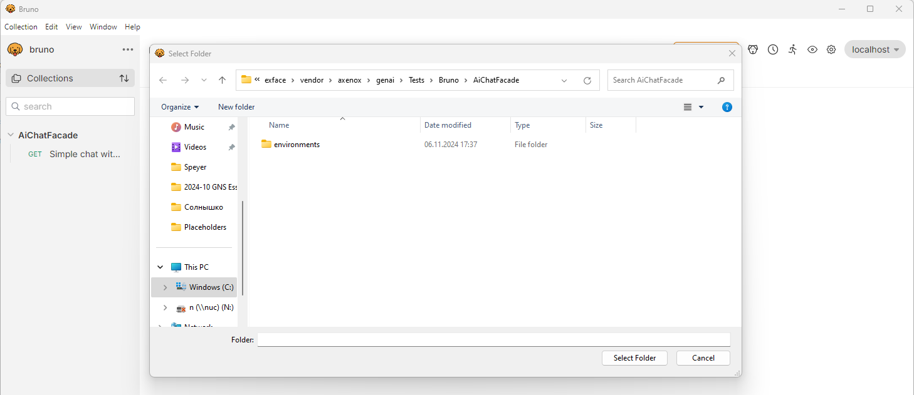
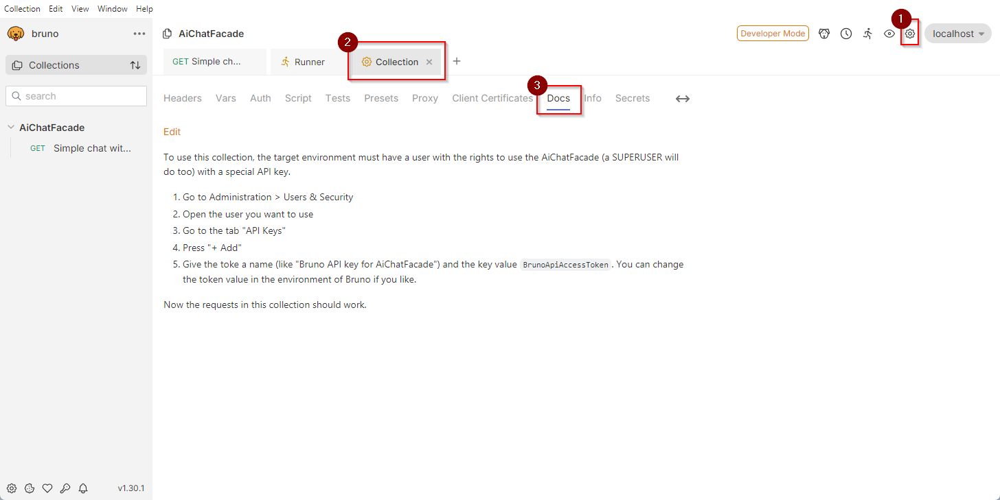

# Testing the AI chat facade with Bruno

This app includes an API collection for the open source API client Bruno (similar to Postman).

## Setup Bruno

1. [Download Bruno](https://www.usebruno.com/downloads) if you do not have it yet.
2. Start Bruno
3. Go to `Collections > Open Collection`
4. Navigate to the folder of this app and there to `Tests/Bruno`
    
5. Click `Select folder`

The collection includes a built-in documentation, that will tell you, how to set up authentication and how to use the built-in environments.

