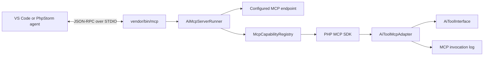

# CLI MCP server for IDE agents

This roadmap describes how AI tools configured in ExFace can be exposed to agents running in IDEs such as VS Code and PhpStorm. The first transport will be a local CLI server using MCP over STDIO. The design must remain transport-independent so that the same configured capabilities can later be exposed over HTTP.

The recommended implementation uses the official [MCP PHP SDK](https://github.com/modelcontextprotocol/php-sdk) behind adapters owned by GenAI. A dedicated CLI runner should bootstrap the process and select the configured endpoint, while the SDK owns the MCP protocol loop.

## Requirements

### Functional requirements

- VS Code, PhpStorm and other MCP clients must be able to start a local ExFace MCP server over STDIO.
- The server must advertise the tools that an app designer explicitly enabled for that MCP endpoint.
- MCP clients must be able to invoke those tools using named JSON arguments.
- Existing AI tool prototypes and their UXON configuration must remain reusable. A tool must not require MCP-specific code or attributes.
- App designers must have a simple UI to create, inspect, version, enable and disable MCP endpoints and their tools.
- Multiple independently configured MCP endpoints must be supported. Each endpoint may expose a different set of tools.
- Tool calls must be visible to designers, including the exact arguments received, result returned, errors and warnings.
- Calls must execute as an authenticated ExFace user and pass the normal facade and data authorization checks.
- The architecture must allow MCP resources, resource templates and prompts to be added later. In particular, read-only DataSheet access should be possible through resources or resource templates.
- Mutating operations, including DataSheet writes, must remain explicit tools so that authorization, confirmation and auditing are clear.

### Operational requirements

- `STDOUT` must contain MCP JSON-RPC messages only. Diagnostics must be written to the workbench logger or `STDERR`.
- A malformed tool call must not terminate the MCP process.
- Tool inputs must be validated before the underlying AI tool is invoked.
- Logs must support redaction of sensitive arguments and limits for large request or result payloads.
- The server must record the selected endpoint and endpoint version, authenticated user, MCP client information, tool name, call ID, arguments, result, errors, timestamps and duration.
- Long-running STDIO processes must not retain a workbench, configured tool instances or other mutable ExFace request state between calls.

### Non-goals for the first release

- Hosting an MCP server on a publicly reachable HTTP endpoint.
- Implementing an MCP client in GenAI.
- Exposing every installed AI tool prototype automatically.
- Replacing the existing `vendor/bin/action` command or converting AI tools into Symfony Console commands.
- Supporting MCP sampling, elicitation or interactive MCP Apps.

## Architecture

### Process and protocol boundary

An MCP server is a long-running JSON-RPC process, not a conventional one-command-per-call CLI. The IDE starts the process once and communicates with it over stdin and stdout:

```text
IDE starts: vendor/bin/mcp axenox.genai:developer-tools
IDE sends:  initialize
IDE sends:  tools/list
IDE sends:  tools/call { name, arguments }
```

The originally considered syntax

```text
vendor/bin/mcp axenox.genai:ModelSearchTool action searchterm
```

would be suitable for a normal CLI tool invocation, but it is not an MCP transport. MCP arguments arrive as named JSON values in `tools/call` requests.



### MCP CLI runner

`vendor/bin/mcp` should start a dedicated `AiMcpServerRunner`, not an instance or subclass of `exface\Core\Facades\ConsoleFacade`. The runner is responsible for the process boundary:

1. Parse the endpoint selector passed to `vendor/bin/mcp`.
2. Open a temporary workbench scope to authenticate the local CLI user, authorize access and load a snapshot of the endpoint's configured capabilities.
3. Stop the startup workbench before entering the protocol loop.
4. Build the MCP server and run the SDK's STDIO transport.
5. Create and stop a fresh workbench scope for every capability operation.

The executable may reuse small, transport-independent authentication helpers from the existing console architecture, but it should not reuse `ConsoleFacade\CommandLoader`, `SymfonyCommandAdapter` or the Symfony Console application. MCP tools are discovered and invoked through MCP messages rather than Symfony commands.

The endpoint selector is the only required positional argument, so a separate command framework adds little value. Basic argument parsing and help output can remain in the executable, before the MCP transport starts. Once startup succeeds, no help text, exception rendering or other command output may be written to `STDOUT`.

### MCP SDK

Use the official `mcp/sdk` package instead of implementing JSON-RPC framing, capability negotiation and protocol versions in GenAI. The SDK provides:

- STDIO and Streamable HTTP transports;
- tool, resource, resource-template and prompt registries;
- protocol initialization and version negotiation;
- structured tool results and MCP error handling;
- PSR logger and container integration;
- protocol conformance coverage.

The SDK is still pre-1.0 and must therefore be isolated behind GenAI-owned interfaces. MCP SDK classes must not appear in `AiToolInterface`, tool UXON models or individual tool prototypes.

As of August 2026, `mcp/sdk` 0.8 requires PHP 8.1 while ExFace Core declares PHP 8.0 or newer. Before adding the dependency, decide whether GenAI may raise its minimum PHP version to 8.1. If PHP 8.0 remains mandatory, use a separately installable PHP 8.1 sidecar package or process. Maintaining a custom MCP protocol implementation is not recommended.

### Endpoint configuration

For the first release, represent an MCP endpoint using a specialized agent prototype, for example `McpServer`. This reuses the existing designer UI, tool UXON, selectors, versioning and enable/disable lifecycle. In the UI it should be called an **MCP endpoint**, not a dummy agent.

An MCP endpoint prototype must:

- expose configured tools without requiring an LLM data connection;
- reject ordinary AI prompt handling;
- provide endpoint name, description, instructions and version;
- provide configured tools to the MCP capability registry;
- allow resources and prompts to be added later.

Example endpoint configuration:

```json
{
	"alias": "axenox.GenAI.McpServer",
	"instructions": "Tools for developing ExFace application models.",
	"tools": {
		"search_model": {
			"alias": "axenox.GenAI.ModelSearchTool",
			"description": "Searches the application model.",
			"arguments": []
		}
	}
}
```

A separate `MCP_ENDPOINT` model may become appropriate later if endpoints accumulate substantial MCP-only configuration such as transport settings, remote authentication, rate limits and resource providers. It is unnecessary for the initial tools-only implementation.

### Tool discovery and registration

There are two distinct discovery concerns:

1. **Prototype discovery** finds which AI tool classes are installed. This already exists through `AI_TOOL_PROTOTYPE` and `AiFactory`.
2. **Endpoint discovery** determines which configured tool instances a specific MCP endpoint is allowed to expose.

Only endpoint discovery may populate MCP `tools/list`. Scanning PHP classes or MCP attributes would expose prototypes rather than the designer-configured instances and could bypass endpoint restrictions.

During the temporary startup workbench scope, `McpCapabilityRegistry` should:

1. Resolve the configured endpoint version.
2. Instantiate its tools through `AiFactory::createToolFromUxon()`.
3. Convert each `AiToolInterface` into an MCP `Tool` definition.
4. Register the definition and a generic handler programmatically with the SDK.

The SDK supports runtime registration by pairing an `Mcp\Schema\Tool` with a `ToolHandlerInterface`. PHP attributes and changes to existing tool classes are therefore not required.

### `AiToolMcpAdapter`

The adapter converts the existing tool contract into MCP metadata and execution. The registry stores immutable MCP definitions and endpoint/tool selectors, not live `AiToolInterface` instances:

- `AiToolInterface::getName()` becomes the MCP tool name.
- `getDescription()` and `getRules()` become the MCP description.
- `getArguments()` becomes an object-typed JSON input schema.
- `getReturnDataType()` guides result serialization and an optional output schema.
- `invoke()` remains the implementation entry point.

`ServiceParameter` maps to JSON Schema as follows:

| Service parameter | JSON Schema |
|---|---|
| `name` | property name |
| `description` | `description` |
| `required` | root `required` list |
| `default_value` | `default` |
| `examples` | `examples` |
| data type | `type`, `format`, `enum`, items and supported constraints |

ExFace data types can express more than JSON Schema. The schema mapper must define explicit mappings for common scalar, list and object data types and use a documented fallback, normally a string plus description, for unsupported constraints.

MCP sends arguments as a named map. Existing AI-agent execution currently passes positional argument values to `invoke()`. The adapter must validate the named map, apply defaults, order values according to `getArguments()` and only then call the existing tool. This preserves compatibility with current tool implementations. Moving `AiToolInterface` itself to named arguments can be considered separately.

Tool exceptions must be translated deliberately:

- expected validation or recoverable tool failures become MCP tool results with `isError: true` so the IDE agent can correct its call;
- unexpected failures become generic MCP protocol errors while full details are retained in the ExFace log;
- warnings remain visible in the invocation log and may be included in result metadata where supported.

Most existing tool results can initially be returned as text. Structured content should be added where a stable output schema is available, especially for future DataSheet capabilities.

### Invocation context

Existing tools require an `AiAgentInterface` and `AiPromptInterface` when invoked. The MCP endpoint prototype can satisfy the agent argument, but an MCP call is not an AI prompt. Introduce an MCP-specific prompt/task adapter that implements the minimum context contract needed by existing tools and carries:

- authenticated user and workbench;
- endpoint and session identifiers;
- MCP client information;
- tool-call ID and named arguments;
- optional workspace or project context supplied by the IDE configuration.

Do not manufacture user messages, model connections or token metadata merely to satisfy the current conversation implementation. Where a tool assumes chat-specific prompt state, either adapt that state explicitly or mark the tool as unsuitable for MCP until its context requirements are generalized.

### Logging and designer visibility

The existing conversation UI is a useful presentation pattern, but `AiConversation` is coupled to `GenericAssistant`, `AiPrompt`, LLM messages, model connections, tokens and costs. MCP calls should not be stored as fake LLM conversations.

Create MCP-specific session and invocation records and expose them through the same monitoring area and interaction patterns as AI conversations. A session represents one IDE connection/process. An invocation represents one `tools/call` request.

Each invocation should store:

- endpoint and endpoint version;
- authenticated ExFace user;
- MCP client name and version from `initialize`;
- session ID and call ID;
- tool name;
- raw named arguments;
- normalized positional arguments passed to the tool;
- textual and structured result;
- warnings and errors;
- start time, finish time and duration;
- success, tool-error or protocol-error outcome.

The detail UI should show the exact request and response while applying configured redaction and payload-size limits. Designers should be able to filter calls by endpoint, tool, user, result and time.

### Multiple MCP servers

Use one Composer executable and select an endpoint with its first argument. Do not create `mcp2`, `mcp3` and similar binaries. VS Code and PhpStorm can register the same executable multiple times with different names and arguments; each registration starts an independent process with its own endpoint, tool list, trust state and IDE-side logs.

Example VS Code configuration:

```json
{
	"servers": {
		"exface-model": {
			"type": "stdio",
			"command": "php",
			"args": [
				"${workspaceFolder}/vendor/bin/mcp",
				"axenox.genai:model-development"
			]
		},
		"customer-data": {
			"type": "stdio",
			"command": "php",
			"args": [
				"${workspaceFolder}/vendor/bin/mcp",
				"customer.app:data-tools"
			]
		}
	}
}
```

Other apps contribute tool prototypes and endpoint models through the normal ExFace app installation mechanisms. They do not need to register additional binaries.

### Authentication and security

The initial STDIO server runs locally under the operating-system user. It can reuse the `CliEnvAuthToken` approach used by `ConsoleFacade`, followed by normal facade authorization. This mapping must be verified on Windows, Linux and remote-development environments because the IDE process environment determines the username.

Tool exposure and tool execution are separate authorization boundaries:

- the endpoint configuration controls what is advertised;
- facade authorization controls who may start the server;
- each tool and its underlying DataSheet or service calls must continue to enforce normal ExFace authorization;
- destructive tools should carry MCP annotations where supported and remain subject to IDE confirmation;
- filesystem and command tools require especially restrictive endpoint configuration.

Endpoint version and configuration must be fixed for the lifetime of a STDIO process. A configuration change takes effect after the IDE restarts the MCP server. Dynamic `tools/list_changed` notifications can be considered later.

### Future HTTP transport

Capability registration must be independent of transport:

```php
$server = $serverFactory->create($endpoint);

return match ($transportType) {
	'stdio' => $server->run(new StdioTransport()),
	'http' => $httpRunner->run($server, $request),
};
```

An `McpHttpFacade` can later reuse the same endpoint loader, capability registry, adapters and invocation logger. HTTP additionally requires remote authentication, mapping the remote identity to an ExFace user, authorization, sessions, CORS, DNS-rebinding protection, request-size limits and rate limiting.

Read-only DataSheet access should normally be exposed as MCP resources or resource templates, for example one resource template per configured object or query. DataSheet creation, update and deletion should be exposed as tools.

## Conciderations

### Should the MCP server use `ConsoleFacade`?

Probably not. The useful similarity is limited to starting ExFace from a CLI process and authenticating the operating-system user. The execution models are otherwise different:

| Action console | MCP STDIO server |
|---|---|
| One command is parsed and executed | One process handles a stream of JSON-RPC requests |
| Symfony Console owns input and output | The MCP SDK owns stdin and stdout |
| Commands are discovered from CLI actions | Capabilities are loaded from one configured MCP endpoint |
| Human-readable console output is expected | Any non-protocol `STDOUT` output corrupts the connection |
| The process normally exits after one action | The process remains alive until the IDE disconnects |

Extending `ConsoleFacade` would couple the MCP server to command loading, command abbreviation, Symfony exception rendering and human-oriented output that it does not need. A separate `vendor/bin/mcp` executable and `AiMcpServerRunner` are smaller and make the protocol boundary explicit.

If ExFace authorization points require a `FacadeInterface`, introduce a minimal MCP-specific facade or security subject for authorization only. It should be composed by the runner rather than inherit from `ConsoleFacade`, and it should not own MCP dispatch.

### Should one workbench remain alive?

The recommended default is **one long-lived MCP transport process with short-lived ExFace workbench scopes**.

A workbench is designed around a PHP request or command lifetime. It caches apps, contexts, model components, security state and data connections. Keeping it alive for an IDE session that may last many hours creates several risks:

- model and customizing changes may not become visible;
- authentication or authorization state may become stale;
- database connections can time out or retain failed transaction state;
- mutable state accidentally retained by an agent or tool can affect later calls;
- memory use can grow over a long IDE session;
- cleanup normally performed by `Workbench::stop()` is delayed until the IDE stops the server.

Creating a fresh workbench for every operation provides request-like isolation and predictable cleanup. Each handler should use this lifecycle:

```php
$workbench = Workbench::startNewInstance();

try {
	// Authenticate, authorize, recreate the configured endpoint and tool,
	// invoke it, and persist the MCP invocation.
} finally {
	$workbench->stop();
}
```

`Workbench::stop()` saves contexts and disconnects all data connections, so it must run in a `finally` block. The handler must also roll back any transaction it owns before stopping the workbench.

The tradeoff is startup cost. Every call reloads configuration and initializes core services, which may be noticeable for small or frequently called tools. Correct isolation should be the first implementation; optimize only after measuring real IDE workloads. Possible later optimizations include a lightweight workbench mode, immutable model caches shared below the workbench boundary, or an explicitly resettable operation scope. Reusing an entire workbench should not be the first optimization because there is currently no complete reset contract for all cached and mutable services.

### Startup discovery versus operation execution

MCP requires a stable capability list after initialization, while per-operation workbenches should see current application data. Use two different scopes:

1. **Startup scope:** resolve and authorize the exact endpoint version, generate immutable MCP tool/resource definitions, and retain only scalar metadata, schemas, endpoint selector/version and tool names. Then stop the workbench.
2. **Operation scope:** start a new workbench, authenticate and authorize again, recreate the pinned endpoint version and selected tool, validate the call against the advertised schema, invoke it, persist the result, and stop the workbench.

The endpoint version is pinned for the lifetime of the MCP process so that execution cannot silently switch to a version with a different schema. If that exact version is disabled, removed or no longer authorized, the call should fail and tell the IDE to restart the MCP server. Configuration changes become visible after restart; dynamic capability notifications can be added later.

The startup scope should not retain closures that capture its workbench, endpoint, tools or DataSheets. SDK handlers should retain only immutable descriptors and a factory capable of opening an operation scope.

### Operations that do not need ExFace

Protocol-level requests such as MCP initialization, ping and returning the already generated capability list do not need a new workbench. Create one only for operations that access ExFace state, including tool calls, resource reads, prompt rendering and persistence. This avoids unnecessary startup overhead while preserving isolation where it matters.

## Implementation plan

### Phase 1: Compatibility spike

- Decide whether GenAI can require PHP 8.1. If not, define the deployment boundary for a PHP 8.1 sidecar.
- Add the official MCP SDK behind a small GenAI-owned server factory.
- Create a temporary STDIO entry point that exposes one hard-coded diagnostic tool.
- Compare measured latency and memory use for a fresh workbench per operation against a long-lived workbench.
- Verify initialization, `tools/list` and `tools/call` with the MCP Inspector, VS Code and PhpStorm.
- Verify that notices, warnings and logger output never leak to `STDOUT`.

The spike is successful when both IDEs can repeatedly invoke the diagnostic tool and reconnect after the process exits.

### Phase 2: ExFace tool adapter

- Implement `ServiceParameterToJsonSchemaMapper` with mappings for the commonly used ExFace data types.
- Implement `AiToolMcpAdapter` and the generic SDK tool handler.
- Normalize named MCP arguments into the positional form expected by existing AI tools.
- Map `AiToolResultInterface`, warnings and exceptions to MCP results.
- Expose one configured `ModelSearchTool` and verify its schema and behavior in both IDEs.

The adapter is successful when an unchanged existing AI tool is listed and invoked with correctly validated arguments.

### Phase 3: Configured MCP endpoints

- Add the specialized MCP endpoint agent prototype without an LLM connection requirement.
- Add an endpoint loader that resolves aliases and semantic versions.
- Implement `McpCapabilityRegistry` using only tools configured on the selected endpoint.
- Add `vendor/bin/mcp <endpoint-selector>` to the GenAI Composer package.
- Implement `AiMcpServerRunner` and a fresh workbench operation scope with authentication and authorization.
- Add designer-facing documentation and a default development endpoint with a conservative tool set.

The endpoint implementation is successful when two IDE server registrations can launch the same binary with different selectors and receive different tool lists.

### Phase 4: Invocation audit trail

- Add MCP session and invocation model objects and installer migrations.
- Persist request, normalized arguments, response, errors, user, client and timing metadata.
- Add redaction and payload-size configuration.
- Add monitoring pages using the established conversation-log interaction patterns.
- Ensure persistence failures are logged but do not corrupt MCP responses or terminate the server.

The audit trail is successful when a designer can reconstruct exactly what the IDE requested and received for every call.

### Phase 5: Hardening

- Add limits for argument size, result size, execution time and calls per session.
- Review command, filesystem, SQL and DataSheet tools for MCP-safe defaults.
- Add destructive/read-only MCP annotations where the SDK and clients support them.
- Test OS-user authentication on Windows and Linux, including remote IDE sessions.
- Add automated adapter tests and MCP protocol integration tests.
- Document VS Code and PhpStorm registration and troubleshooting.

### Phase 6: Resources and HTTP

- Introduce transport-independent resource and resource-template adapters.
- Add configured read-only DataSheet resources.
- Add `McpHttpFacade` using the same server factory and registry.
- Define remote authentication and authorization before enabling HTTP outside localhost.
- Evaluate dynamic capability-change notifications and MCP prompts only after the core tool server is stable.

## Decisions and open questions

### Recommended decisions

- Use the official PHP MCP SDK.
- Use a dedicated MCP runner instead of `ConsoleFacade` or Symfony Console.
- Keep the MCP process alive but create and stop a fresh workbench for every ExFace operation.
- Register configured tools programmatically; do not scan MCP attributes.
- Keep existing AI tools MCP-agnostic through an adapter.
- Start with a specialized MCP endpoint agent prototype.
- Use one `vendor/bin/mcp` executable for all endpoints.
- Store MCP invocations with MCP-specific semantics while reusing conversation-monitoring UI patterns.
- Treat DataSheet reads as future resources and DataSheet writes as tools.

### Open questions before implementation

- Can GenAI raise its minimum PHP version from 8.0 to 8.1?
- Which ExFace data types and validation constraints must the first JSON Schema mapper support?
- Should the initial MCP endpoint be available to every authenticated CLI user or only selected roles?
- Which existing tools are safe enough for the default endpoint?
- Which argument fields and result types require redaction by default?
- Does the current operating-system username mapping work reliably for all supported IDE and remote-development setups?