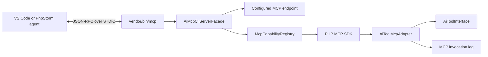

# CLI MCP server for IDE agents

This roadmap describes how AI tools configured in ExFace can be exposed to agents running in IDEs such as VS Code and PhpStorm. The first transport will be a local CLI server using MCP over STDIO. The design must remain transport-independent so that the same configured capabilities can later be exposed over HTTP.

The recommended implementation uses the official [MCP PHP SDK](https://github.com/modelcontextprotocol/php-sdk) behind adapters owned by GenAI. A dedicated CLI runner should bootstrap the process and select the configured endpoint, while the SDK owns the MCP protocol loop.

## Requirements

### Functional requirements

- VS Code, PhpStorm and other MCP clients must be able to start a local ExFace MCP server over STDIO.
- The server must advertise the tools that an app designer explicitly enabled for that MCP endpoint.
- MCP clients must be able to invoke those tools using named JSON arguments.
- Existing AI tool prototypes and their UXON configuration must remain reusable. A tool must not require MCP-specific code or attributes.
- App designers must have a simple UI to create, inspect, version, enable and disable MCP endpoints and their tools.
- Multiple independently configured MCP endpoints must be supported. Each endpoint may expose a different set of tools.
- Tool calls must be visible to designers, including the exact arguments received, result returned, errors and warnings.
- Calls must execute as an authenticated ExFace user and pass the normal facade and data authorization checks.
- The architecture must allow MCP resources, resource templates and prompts to be added later. In particular, read-only DataSheet access should be possible through resources or resource templates.
- Mutating operations, including DataSheet writes, must remain explicit tools so that authorization, confirmation and auditing are clear.

### Operational requirements

- `STDOUT` must contain MCP JSON-RPC messages only. Diagnostics must be written to the workbench logger or `STDERR`.
- A malformed tool call must not terminate the MCP process.
- Tool inputs must be validated before the underlying AI tool is invoked.
- Logs must support redaction of sensitive arguments and limits for large request or result payloads.
- The server must record the selected endpoint and endpoint version, authenticated user, MCP client information, tool name, call ID, arguments, result, errors, timestamps and duration.
- Long-running STDIO processes must not retain a workbench, configured tool instances or other mutable ExFace request state between calls.

### Non-goals for the first release

- Hosting an MCP server on a publicly reachable HTTP endpoint.
- Implementing an MCP client in GenAI.
- Exposing every installed AI tool prototype automatically.
- Replacing the existing `vendor/bin/action` command or converting AI tools into Symfony Console commands.
- Supporting MCP sampling, elicitation or interactive MCP Apps.

## Architecture

### Process and protocol boundary

An MCP server is a long-running JSON-RPC process, not a conventional one-command-per-call CLI. The IDE starts the process once and communicates with it over stdin and stdout:

```text
IDE starts: vendor/bin/mcp axenox.genai:developer-tools
IDE sends:  initialize
IDE sends:  tools/list
IDE sends:  tools/call { name, arguments }
```

The originally considered syntax

```text
vendor/bin/mcp axenox.genai:ModelSearchTool action searchterm
```

would be suitable for a normal CLI tool invocation, but it is not an MCP transport. MCP arguments arrive as named JSON values in `tools/call` requests.



### Classes and namespaces

Place MCP specific classes in `axenox\GenAI\Common\MCP`  names pace. Classes required for the CLI MCP facade only (not for future HTTP facades) go to `axenox\GenAi\Facades\AiMcpCliFacade\`.

### MCP CLI runner

`vendor/bin/mcp` should start a dedicated `axenox\GenAI\Facades\AiMcpCliServerFacade`, not an instance or subclass of `exface\Core\Facades\ConsoleFacade`. This MCP runner is still a facade, but of a totally different type. It is responsible for the process boundary:

1. Parse the endpoint selector passed to `vendor/bin/mcp`.
2. Open a temporary workbench scope to authenticate the local CLI user, authorize access and load a snapshot of the endpoint's configured capabilities.
3. Stop the startup workbench before entering the protocol loop.
4. Build the MCP server and run the SDK's STDIO transport.
5. Create and stop a fresh workbench scope for every capability operation.

The executable may reuse small, transport-independent authentication helpers from the existing console architecture, but it should not reuse `ConsoleFacade\CommandLoader`, `SymfonyCommandAdapter` or the Symfony Console application. MCP tools are discovered and invoked through MCP messages rather than Symfony commands.

The endpoint selector is the only required positional argument, so a separate command framework adds little value. Basic argument parsing and help output can remain in the executable, before the MCP transport starts. Once startup succeeds, no help text, exception rendering or other command output may be written to `STDOUT`.

### MCP SDK

Use the official `mcp/sdk` package instead of implementing JSON-RPC framing, capability negotiation and protocol versions in GenAI. The SDK provides:

- STDIO and Streamable HTTP transports;
- tool, resource, resource-template and prompt registries;
- protocol initialization and version negotiation;
- structured tool results and MCP error handling;
- PSR logger and container integration;
- protocol conformance coverage.

The SDK is still pre-1.0 and must therefore be isolated behind GenAI-owned interfaces. MCP SDK classes must not appear in `AiToolInterface`, tool UXON models or individual tool prototypes.

As of August 2026, `mcp/sdk` 0.8 requires PHP 8.1 while ExFace Core declares PHP 8.0 or newer. Before adding the dependency, decide whether GenAI may raise its minimum PHP version to 8.1. If PHP 8.0 remains mandatory, use a separately installable PHP 8.1 sidecar package or process. Maintaining a custom MCP protocol implementation is not recommended.

### Endpoint configuration

To allow easy configurations, represent an MCP endpoint using a SPECIALIZED AI agent prototype class - `McpServer`. Do not extend GenericAssistant. Instead, extrack code required for both of them into `axenox\GenAi\Common\AbstractAgent`. This reuses the existing designer UI, tool UXON, selectors, versioning and enable/disable lifecycle. In the UI it should be called an **MCP endpoint**, not a dummy agent.

An MCP endpoint prototype must:

- expose configured tools without requiring an LLM data connection;
- reject ordinary AI prompt handling;
- provide endpoint name, description, instructions and version;
- provide configured tools to the MCP capability registry;
- allow resources and prompts to be added later.

In contrast to the `GenericAssistant`, the MCP does not need concepts - only tools. In fact, it does not even need a user prompt or instructions, but for now, let us still keep full compatibility with AIPrompt task class for both. Create a compatible `McpTask extends AI Prompt` for now. We will take care of separating the task classes later. Same goes for the `AiConversation` - just keep it for now.
Example endpoint configuration:

```json
{
    "alias": "axenox.GenAI.McpServer",
    "tools": {
        "search_model": {
            "alias": "axenox.GenAI.ModelSearchTool",
            "description": "Searches the application model.",
            "arguments": []
        }
    }
}
```

A separate `MCP_ENDPOINT` model may become appropriate later if endpoints accumulate substantial MCP-only configuration such as transport settings, remote authentication, rate limits and resource providers. It is unnecessary for the initial tools-only implementation.

### Tool discovery and registration

There are two distinct discovery concerns:

1. **Prototype discovery** finds which AI tool classes are installed. This already exists through `AI_TOOL_PROTOTYPE` and `AiFactory`.
2. **Endpoint discovery** determines which configured tool instances a specific MCP endpoint is allowed to expose.

Only endpoint discovery may populate MCP `tools/list`. Scanning PHP classes or MCP attributes would expose prototypes rather than the designer-configured instances and could bypass endpoint restrictions.

During the temporary startup workbench scope, `McpCapabilityRegistry` should:

1. Resolve the configured endpoint version.
2. Instantiate its tools through `AiFactory::createToolFromUxon()`.
3. Convert each `AiToolInterface` into an MCP `Tool` definition.
4. Register the definition and a generic handler programmatically with the SDK.

The SDK supports runtime registration by pairing an `Mcp\Schema\Tool` with a `ToolHandlerInterface`. PHP attributes and changes to existing tool classes are therefore not required.

### `AiToolMcpAdapter`

The adapter converts the existing tool contract into MCP metadata and execution. The registry stores immutable MCP definitions and endpoint/tool selectors, not live `AiToolInterface` instances:

- `AiToolInterface::getName()` becomes the MCP tool name.
- `getDescription()` and `getRules()` become the MCP description.
- `getArguments()` becomes an object-typed JSON input schema.
- `getReturnDataType()` guides result serialization and an optional output schema.
- `invoke()` remains the implementation entry point.

Map `ServiceParameter` to JSON Schema via `JsonDataType::convertDataTypeToJsonSchemaType()` and similar tools. If the static methods of the data type are not enough, extend them - but only for general purpose JSONschema logic. The Core data type must not have anything to do with MCP protocols specifically.

See tool to JSON schema converters in `ResponsesApiRequest`. Here is the general overview:

| Service parameter | JSON Schema                                               |
| ----------------- | --------------------------------------------------------- |
| `name`            | property name                                             |
| `description`     | `description`                                             |
| `required`        | root `required` list                                      |
| `default_value`   | `default`                                                 |
| `examples`        | `examples`                                                |
| data type         | `type`, `format`, `enum`, items and supported constraints |

MCP sends arguments as a named map. Existing AI-agent execution currently passes positional argument values to `invoke()`. The adapter must validate the named map, apply defaults, order values according to `getArguments()` and only then call the existing tool. This preserves compatibility with current tool implementations. Moving `AiToolInterface` itself to named arguments can be considered separately.

Tool exceptions must be translated deliberately:

- expected validation or recoverable tool failures become MCP tool results with `isError: true` so the IDE agent can correct its call;
- unexpected failures become generic MCP protocol errors while full details are retained in the ExFace log;
- warnings remain visible in the invocation log and may be included in result metadata where supported.

Most existing tool results can initially be returned as text. Structured content should be added where a stable output schema is available, especially for future DataSheet capabilities.

### Invocation context

Existing tools require an `AiAgentInterface` and `AiPromptInterface` when invoked. The MCP endpoint prototype can satisfy the agent argument, but an MCP call is not an AI prompt. Nevertheless, we should keep full compatibility with the `AiPrompt` for now.

Introduce an MCP-specific task class, that extends AiPrompt. In the comments, state, that this is temporary and explain the minimum context contract needed by existing tools and carries in future:

- authenticated user and workbench;
- endpoint and session identifiers;
- MCP client information;
- tool-call ID and named arguments;
- optional workspace or project context supplied by the IDE configuration.

Fake (empty) user messages if needed, but do not manufacture model connections or token metadata merely to satisfy the current conversation implementation. Where a tool assumes chat-specific prompt state, either adapt that state explicitly or mark the tool as unsuitable for MCP until its context requirements are generalized.

### Logging and designer visibility

The existing conversation UI is a useful presentation pattern, but `AiConversation` is coupled to `GenericAssistant`, `AiPrompt`, LLM messages, model connections, tokens and costs. MCP calls do not fit this architecture well, but we will take care of this later. For now, make sure, the AiConversation has fallbacks in case anything is missing. Also replace class-bound type hints with interfaces where appropriate. Take notes in the class doc of `AiConversation` about what you would recommend to separate true Ai conversations from MCP calls in future.

### Multiple MCP servers

Use one Composer executable and select an endpoint with its first argument. Do not create `mcp2`, `mcp3` and similar binaries. VS Code and PhpStorm can register the same executable multiple times with different names and arguments; each registration starts an independent process with its own endpoint, tool list, trust state and IDE-side logs.

Example VS Code configuration:

```json
{
    "servers": {
        "exface-model": {
            "type": "stdio",
            "command": "php",
            "args": [
                "${workspaceFolder}/vendor/bin/mcp",
                "axenox.genai:model-development"
            ]
        },
        "customer-data": {
            "type": "stdio",
            "command": "php",
            "args": [
                "${workspaceFolder}/vendor/bin/mcp",
                "customer.app:data-tools"
            ]
        }
    }
}
```

Other apps contribute tool prototypes and endpoint models through the normal ExFace app installation mechanisms. They do not need to register additional binaries.

### Authentication and security

The initial STDIO server runs locally under the operating-system user. It can reuse the `CliEnvAuthToken` approach used by `ConsoleFacade`, followed by normal facade authorization. This mapping must be verified on Windows, Linux and remote-development environments because the IDE process environment determines the username.

Tool exposure and tool execution are separate authorization boundaries:

- the endpoint configuration controls what is advertised;
- facade authorization controls who may start the server;
- each tool and its underlying DataSheet or service calls must continue to enforce normal ExFace authorization;
- destructive tools should carry MCP annotations where supported and remain subject to IDE confirmation;
- filesystem and command tools require especially restrictive endpoint configuration.

Endpoint version and configuration must be fixed for the lifetime of a STDIO process. A configuration change takes effect after the IDE restarts the MCP server. Dynamic `tools/list_changed` notifications can be considered later.

### Future HTTP transport

Capability registration must be independent of transport:

```php
$server = $serverFactory->create($endpoint);

return match ($transportType) {
    'stdio' => $server->run(new StdioTransport()),
    'http' => $httpRunner->run($server, $request),
};
```

An `McpHttpFacade` can later reuse the same endpoint loader, capability registry, adapters and invocation logger. HTTP additionally requires remote authentication, mapping the remote identity to an ExFace user, authorization, sessions, CORS, DNS-rebinding protection, request-size limits and rate limiting.

Read-only DataSheet access should normally be exposed as MCP resources or resource templates, for example one resource template per configured object or query. DataSheet creation, update and deletion should be exposed as tools.

## Conciderations

### Should the MCP server use `ConsoleFacade`?

Probably not. The useful similarity is limited to starting ExFace from a CLI process and authenticating the operating-system user. The execution models are otherwise different:

| Action console                              | MCP STDIO server                                         |
| ------------------------------------------- | -------------------------------------------------------- |
| One command is parsed and executed          | One process handles a stream of JSON-RPC requests        |
| Symfony Console owns input and output       | The MCP SDK owns stdin and stdout                        |
| Commands are discovered from CLI actions    | Capabilities are loaded from one configured MCP endpoint |
| Human-readable console output is expected   | Any non-protocol `STDOUT` output corrupts the connection |
| The process normally exits after one action | The process remains alive until the IDE disconnects      |

Extending `ConsoleFacade` would couple the MCP server to command loading, command abbreviation, Symfony exception rendering and human-oriented output that it does not need. A separate `vendor/bin/mcp` executable and `AiMcpServerFacade` are smaller and make the protocol boundary explicit.

If ExFace authorization points require a `FacadeInterface`, introduce a minimal MCP-specific facade or security subject for authorization only. It should be composed by the runner rather than inherit from `ConsoleFacade`, and it should not own MCP dispatch.

### Should one workbench remain alive?

The recommended default is **one long-lived MCP transport process with short-lived ExFace workbench scopes**.

A workbench is designed around a PHP request or command lifetime. It caches apps, contexts, model components, security state and data connections. Keeping it alive for an IDE session that may last many hours creates several risks:

- model and customizing changes may not become visible;
- authentication or authorization state may become stale;
- database connections can time out or retain failed transaction state;
- mutable state accidentally retained by an agent or tool can affect later calls;
- memory use can grow over a long IDE session;
- cleanup normally performed by `Workbench::stop()` is delayed until the IDE stops the server.

Creating a fresh workbench for every operation provides request-like isolation and predictable cleanup. Each handler should use this lifecycle:

```php
$workbench = Workbench::startNewInstance();

try {
    // Authenticate, authorize, recreate the configured endpoint and tool,
    // invoke it, and persist the MCP invocation.
} finally {
    $workbench->stop();
}
```

`Workbench::stop()` saves contexts and disconnects all data connections, so it must run in a `finally` block. The handler must also roll back any transaction it owns before stopping the workbench.

The tradeoff is startup cost. Every call reloads configuration and initializes core services, which may be noticeable for small or frequently called tools. Correct isolation should be the first implementation; optimize only after measuring real IDE workloads. Possible later optimizations include a lightweight workbench mode, immutable model caches shared below the workbench boundary, or an explicitly resettable operation scope. Reusing an entire workbench should not be the first optimization because there is currently no complete reset contract for all cached and mutable services.

### Startup discovery versus operation execution

MCP requires a stable capability list after initialization, while per-operation workbenches should see current application data. Use two different scopes:

1. **Startup scope:** resolve and authorize the exact endpoint version, generate immutable MCP tool/resource definitions, and retain only scalar metadata, schemas, endpoint selector/version and tool names. Then stop the workbench.
2. **Operation scope:** start a new workbench, authenticate and authorize again, recreate the pinned endpoint version and selected tool, validate the call against the advertised schema, invoke it, persist the result, and stop the workbench.

The endpoint version is pinned for the lifetime of the MCP process so that execution cannot silently switch to a version with a different schema. If that exact version is disabled, removed or no longer authorized, the call should fail and tell the IDE to restart the MCP server. Configuration changes become visible after restart; dynamic capability notifications can be added later.

The startup scope should not retain closures that capture its workbench, endpoint, tools or DataSheets. SDK handlers should retain only immutable descriptors and a factory capable of opening an operation scope.

### Operations that do not need ExFace

Protocol-level requests such as MCP initialization, ping and returning the already generated capability list do not need a new workbench. Create one only for operations that access ExFace state, including tool calls, resource reads, prompt rendering and persistence. This avoids unnecessary startup overhead while preserving isolation where it matters.

## Testing

### Why an MCP STDIO server is unusual to test

There is no URL to open, no HTTP status code and no browser. The server is a process that speaks newline-delimited JSON-RPC over stdin and stdout, which changes what testing means:

- **The transport is also the output channel.** A single stray `echo`, PHP notice, BOM or trailing newline after `?>` corrupts the stream. Many "the server does not work" reports will not be logic bugs at all, so `STDOUT` purity deserves its own assertion from day one.
- **State is per process.** `initialize` must precede everything else and the advertised capabilities are frozen for the process lifetime, so a test is always a *session*, not a single call.
- **Two independent failure domains.** Protocol correctness (framing, initialization, schemas, error classes) and ExFace correctness (authentication, workbench lifecycle, tool behavior) fail in completely different ways and are best probed with different tools.
- **We cannot lean on unit tests.** The Core has no unit test suite and Behat lives in `axenox/bdt`, so the practical test assets here are small scripts and command lines that a developer or CI can run.

The approaches below are ordered by how early they become usable. All of them work against `vendor/bin/mcp`; on Windows invoke it as `php vendor\bin\mcp ...`. Each one carries a note on how to attach a debugger to it, because stepping through the server is the only practical way to understand a failure that the protocol reports as a flat "connection closed".

### Debugging with Xdebug

Xdebug is the central tool here, and every approach below runs our PHP as a **process somebody else spawned**. Debugging is therefore always *attach*, never *launch*: start the listener first (VS Code: a `php` configuration with `"request": "launch"`, which in the PHP Debug extension means listening on port 9003; PhpStorm: *Start Listening for PHP Debug Connections*), then let the test harness start the server. What differs per approach is only how the trigger reaches the child process and how long the client waits before declaring the server dead.

Configure the CLI SAPI once:

```ini
xdebug.mode=debug
xdebug.start_with_request=trigger
xdebug.client_host=127.0.0.1
xdebug.client_port=9003
xdebug.cli_color=0
html_errors=0
display_errors=stderr
```

Four rules are specific to an MCP server:

- **Nothing may reach `STDOUT`.** `xdebug.cli_color=0`, `html_errors=0` and `display_errors=stderr` are not cosmetic: Xdebug's colored output, its `var_dump()` override and PHP's own error printer all write to `STDOUT` on CLI by default and will corrupt the protocol mid-session. Prefer `xdebug.mode=debug` over `develop` for the same reason. A debugging session that "breaks the server" is usually this.
- **Use `start_with_request=trigger`, never `yes`.** With `yes`, every PHP process on the machine tries to reach the debugger, including unrelated `vendor/bin/action` runs and the web workbench. With `trigger`, only processes carrying `XDEBUG_TRIGGER` break, which is exactly what the per-approach notes set.
- **A breakpoint pauses the client's clock.** Every MCP client applies connection and request timeouts and will treat a paused server as hung, then kill it. Raise the timeout where the client allows it, and prefer breakpoints inside the tool invocation over the startup path, where clients are least patient.
- **The per-operation workbench multiplies breakpoint hits.** With a fresh workbench per call, a breakpoint in bootstrap fires on every single tool call and on every capability request. Set breakpoints in the adapter or the tool instead.

`fwrite(STDERR, ...)` stays a legitimate first instrument: it is visible in every approach below, cannot corrupt the protocol and needs no listener. The same applies to `DebugStopWatch` output, as long as it is routed to the log or `STDERR`.

### Approaches without a UI

#### A. Raw pipe smoke test - zero dependencies

Usable from the very first commit of Phase 1 and requires nothing but PHP. MCP STDIO framing is one JSON object per line (no `Content-Length` headers, unlike LSP), so a plain text file piped into the process is a valid client session.

`Tests/Mcp/smoke.jsonl`:

```json
{"jsonrpc":"2.0","id":1,"method":"initialize","params":{"protocolVersion":"2026-07-28","capabilities":{},"clientInfo":{"name":"smoke","version":"1.0"}}}
{"jsonrpc":"2.0","method":"notifications/initialized"}
{"jsonrpc":"2.0","id":2,"method":"tools/list","params":{}}
{"jsonrpc":"2.0","id":3,"method":"tools/call","params":{"name":"ping","arguments":{}}}
```

```powershell
Get-Content .\Tests\Mcp\smoke.jsonl | php vendor\bin\mcp axenox.genai:developer-tools
```

Caveats worth knowing before trusting the result:

- The pipe is fire-and-forget: it does not wait for the `initialize` response before sending the next line. The SDK handles messages in order, so this is fine as a smoke test, but ordering and timing bugs will not surface here.
- Take `protocolVersion` from the SDK's own constant rather than hard-coding it permanently; the server answers with the version it actually negotiated, and that response is itself worth asserting.
- Closing stdin ends the process, which is exactly what makes this scriptable.

The most valuable early assertion is `STDOUT` purity:

```powershell
Get-Content .\Tests\Mcp\smoke.jsonl | php vendor\bin\mcp axenox.genai:developer-tools 2> stderr.log |
    ForEach-Object { $null = ($_ | ConvertFrom-Json) }   # throws on the first non-JSON line
```

Everything diagnostic must end up in `stderr.log` or the workbench log instead. Performance instrumentation used to answer the Phase 1 workbench-lifetime question falls under the same rule: `DebugStopWatch` output must never reach `STDOUT`, and the instrumentation must be removed before the phase is closed.

**Debugging:** by far the easiest of all approaches, because we own the entire command line and no client is waiting on a timeout. Set the trigger in the shell and step for as long as needed:

```powershell
$env:XDEBUG_TRIGGER = 1
Get-Content .\Tests\Mcp\smoke.jsonl | php vendor\bin\mcp axenox.genai:developer-tools
```

Whenever a bug is reproducible without a real client, reproduce it here first and debug it here - the other approaches only add a spawning harness between you and the process.

#### B. MCP Inspector CLI - the CI workhorse

The [MCP Inspector](https://modelcontextprotocol.io/docs/2026-07-28/tools/inspector) ships three clients behind one npm binary. The `--cli` client is non-interactive and machine-readable, so it is the right default once Node 22.19 or newer is available:

```bash
npx @modelcontextprotocol/inspector --cli php vendor/bin/mcp axenox.genai:developer-tools --method initialize
npx @modelcontextprotocol/inspector --cli php vendor/bin/mcp axenox.genai:developer-tools --method tools/list
npx @modelcontextprotocol/inspector --cli php vendor/bin/mcp axenox.genai:developer-tools \
  --method tools/call --tool-name search_model --tool-arg term=ORDER --format json
```

It performs a real handshake, validates against the spec, exits with a meaningful code and prints JSON that can be piped into `jq -e`. Compared to approach A it costs a Node dependency but catches protocol errors that a hand-written pipe silently tolerates. Use `--` before any argument meant for our binary rather than for the Inspector.

**Debugging:** the Inspector passes environment variables to the process it spawns with `-e`, and `--connect-timeout` buys the time a breakpoint costs:

```bash
npx @modelcontextprotocol/inspector -e XDEBUG_TRIGGER=1 --connect-timeout 600000 \
  --cli php vendor/bin/mcp axenox.genai:developer-tools --method tools/list
```

Without the raised timeout the CLI aborts the session while you are still stepping, and the resulting error message describes the timeout rather than the bug.

#### C. Scripted ExFace-side checks

Some things are cheaper to verify without MCP at all: that `AiFactory` builds the configured tools, that the JSON Schema generated for a `ServiceParameter` looks as expected, or that authentication resolves the OS user. A tiny CLI script or an existing action invoked through `vendor/bin/action` isolates those without process plumbing. This is a complement, never a substitute - it proves nothing about what a client actually receives.

**Debugging:** plain PHP CLI debugging with no harness, no stdio and no timeout - which is the main reason to keep this approach around for schema, factory and authentication questions.

### Approaches with a UI

#### D. MCP Inspector TUI

```bash
npx @modelcontextprotocol/inspector --tui php vendor/bin/mcp axenox.genai:developer-tools
```

An interactive terminal client: browse tools, fill arguments, read the transcript, watch `STDERR`. The right choice on a server, over SSH or in a remote-development session where no browser is available.

**Debugging:** `-e XDEBUG_TRIGGER=1` as in approach B. The TUI keeps the process alive between calls, so a single attached session covers many invocations instead of one - a real advantage over the CLI when stepping through several tools in a row. Note that a remote-development setup also needs `xdebug.client_host` pointing back at the machine running the IDE.

#### E. MCP Inspector web client - the richest surface

```bash
npx @modelcontextprotocol/inspector php vendor/bin/mcp axenox.genai:developer-tools
```

The launcher prints a URL carrying a one-time session token; open exactly that URL. The Tools tab renders our input schemas as forms and the results with structured content, the Protocol tab shows the full JSON-RPC transcript, and the Console tab shows the server process's `STDERR` - which makes the `STDOUT`/`STDERR` split directly observable. This is the fastest way to explore a tool interactively and to see how an unfamiliar argument schema actually looks to a client.

**Debugging:** launch with `-e XDEBUG_TRIGGER=1` and raise the request timeout in Server Settings before setting a breakpoint. The connection stays open across calls, so breaking inside a tool call is comfortable and the Protocol tab afterwards shows exactly which message the debugger was serving. Breaking before `initialize` completes is not - the connect timeout usually wins. The Console tab doubles as the `STDERR` view, which makes this the best place to correlate a breakpoint with the log output around it.

#### F. VS Code and PhpStorm - the real clients

The Inspector proves conformance; the IDEs prove usability. Only here do we see trust prompts, how tool names and descriptions read to an agent, whether an LLM can pick the right tool from our descriptions, and what happens on reconnect after the process dies.

VS Code reads `.vscode/mcp.json` from the workspace (`MCP: Open Workspace Folder Configuration`) or the user profile (`MCP: Open User Configuration`). Registering our binary twice with different selectors is also the acceptance test for endpoint isolation in Phase 3:

```json
{
    "servers": {
        "exface-model": {
            "type": "stdio",
            "command": "php",
            "args": ["c:/wamp/www/exface/exface/vendor/bin/mcp", "axenox.genai:developer-tools"]
        },
        "exface-data": {
            "type": "stdio",
            "command": "php",
            "args": ["c:/wamp/www/exface/exface/vendor/bin/mcp", "customer.app:data-tools"]
        }
    }
}
```

`${workspaceFolder}` only helps when the workspace root is the ExFace installation. In a multi-root setup where the folders are the app packages, use an absolute path to `vendor/bin/mcp`.

Working with it:

- `MCP: List Servers` gives Start, Stop, Restart, Show Output and Show Configuration for each server. Restart after every code change unless `chat.mcp.autostart` is enabled.
- The first start asks for trust. Starting a server directly from `mcp.json` skips that prompt, so use the command palette when the prompt itself is what you want to see. `MCP: Reset Trust` replays it.
- **Show Output is the primary debugging surface**: it carries the handshake, the tool discovery result and the server process's `STDERR`. If our process writes anything non-protocol to `STDOUT`, this is where it shows up as a parse error - a real-client confirmation of the purity requirement.
- **Configure Tools** in the chat input lists the discovered tools, which is `tools/list` as the user sees it. This is the fastest review of whether our tool names and descriptions are self-explanatory.
- Resources (Phase 6) appear under Add Context > MCP Resources or `MCP: Browse Resources`; prompts are invoked as `/<server>.<prompt>`.

One limit to keep in mind: invocation is non-deterministic. The agent decides whether to call a tool, so a tool not being called may only mean the model chose otherwise - never use VS Code to assert that a call produces a specific result, use the Inspector CLI for that.

**Debugging:** VS Code's own MCP dev/debug support targets Node and Python, so attach Xdebug instead. Add the trigger to the server entry and start the listener before starting the server:

```json
{
    "servers": {
        "exface-model": {
            "type": "stdio",
            "command": "php",
            "args": ["c:/wamp/www/exface/exface/vendor/bin/mcp", "axenox.genai:developer-tools"],
            "env": { "XDEBUG_TRIGGER": "1" }
        }
    }
}
```

Restarting the server from `MCP: List Servers` re-triggers the connection, so one listener serves the whole session. This is the least patient of all clients during startup: a breakpoint in the bootstrap or in `initialize` will usually get the server killed as unresponsive before the debugger is useful, and the failure is reported as a startup error rather than a timeout. Keep breakpoints in the tool handler, and move startup problems to approach A instead. PhpStorm behaves the same way; only the listener is started differently.

#### G. A native MCP test page inside the platform

Because we own both the server and the endpoint model, a test page can drive the capability registry and adapters in-process: list the configured tools, render an argument form from the JSON Schema we already generate, invoke the tool and show the result next to the invocation log from Phase 4. Same pattern as the existing agent test and conversation-monitoring pages, no Node, and it works on a hosted test system where `npx` is not an option. It bypasses the transport entirely, so it verifies our adapters and configuration but **not** protocol conformance.

**Debugging:** an ordinary web request, so the usual ExFace workflow applies - `XDEBUG_SESSION` cookie or browser trigger, no spawning, no stdio, no client timeout, and `STDOUT` carries no protocol, so `var_dump()` is allowed again. Once the adapters exist, this is the most comfortable way to debug them; just remember that everything in the transport layer stays untested.

### Comparison

| Approach                  | Needs Node | UI       | Protocol conformance | ExFace logic | Scriptable | Hosted test system      | Debugging                              |
| ------------------------- | ---------- | -------- | -------------------- | ------------ | ---------- | ----------------------- | -------------------------------------- |
| A. Raw pipe               | no         | none     | shallow              | yes          | yes        | yes                     | trivial, no timeout                    |
| B. Inspector CLI          | yes        | none     | yes                  | yes          | yes        | only with Node          | `-e` + raised `--connect-timeout`      |
| C. Scripted ExFace checks | no         | none     | no                   | yes          | yes        | yes                     | trivial, no harness                    |
| D. Inspector TUI          | yes        | terminal | yes                  | yes          | no         | only with Node          | `-e`, process stays alive              |
| E. Inspector web          | yes        | browser  | yes                  | yes          | partly     | loopback only           | `-e` + timeout in Server Settings      |
| F. VS Code / PhpStorm     | no         | IDE      | yes                  | yes          | no         | developer machines only | env in `mcp.json`, tight startup limit |
| G. Native test page       | no         | browser  | no                   | yes          | no         | yes                     | normal web request                     |

### Can a facade render the Inspector UI, like `IDEFacade` does for AdminNeo?

Not in the same way. The AdminNeo integration works because AdminNeo *is* PHP: `IDEFacade` includes its sources, configures it in-process and captures the rendered output. The Inspector is a React single-page app backed by a **Node** server that owns every MCP connection - the browser never speaks MCP itself, it calls the Node backend over `/api/*`, and that backend spawns STDIO processes, holds OAuth state and guards its routes with a per-launch token. There is no PHP port to embed, so a facade cannot host it the way `AdminneoAPI` hosts AdminNeo.

Three options, in increasing cost:

1. **Link out to a locally running Inspector.** Keep it a developer-machine tool started via `npx` and let our UI only produce the ready-made command line and, once the HTTP transport exists, a deep link into an already running Inspector:

   ```
   http://127.0.0.1:6274/?serverUrl=<encoded endpoint url>&transport=http&autoConnect=<session token>
   ```

   `autoConnect` is a mandatory CSRF gate and must equal the Inspector's session token, so this only works when the Inspector was launched with a pinned `MCP_INSPECTOR_API_TOKEN` that our configuration also knows. An iframe additionally requires `ALLOWED_ORIGINS` to list the workbench origin, and the Inspector's own framing headers would have to be verified - it is built to be browsed at loopback, not embedded.

2. **Reverse-proxy the Inspector through a facade.** Technically possible - a facade route could forward to `http://127.0.0.1:6274` much like `IDEFacade` forwards to AdminNeo - but it buys little and costs a lot: the connection between SPA and Node backend is long-lived and event-streamed, which our buffered PSR-7 responses handle badly; the token, origin allow-list and DNS-rebinding protections all have to be re-satisfied behind the proxy; and a Node runtime becomes a hard requirement of the ExFace installation. Not recommended.

3. **Build the native test page** described as approach G above.

Recommendation: use the Inspector as-is for protocol and IDE-compatibility testing, and if a UI inside the platform is wanted, build the native test page instead of proxying someone else's Node app.

### Recommended test after each implementation step

Each phase below adds one new class of risk, so each gets one primary approach. Earlier tests stay in place and should keep passing.

| Phase                           | Primary approach              | Concretely                                                                                                                                                                                          |
| ------------------------------- | ----------------------------- | --------------------------------------------------------------------------------------------------------------------------------------------------------------------------------------------------- |
| 1 Compatibility spike           | A, then B, then E, then F     | Pipe `smoke.jsonl` at the diagnostic tool; assert every `STDOUT` line parses as JSON; repeat through the Inspector CLI; explore once in the web client; finally register in VS Code and PhpStorm.    |
| 2 ExFace tool adapter           | E for schemas, B for edges    | Read the generated form in the Tools tab, then drive argument edge cases from the CLI: missing required, wrong type, out-of-enum, defaults applied, and a deliberately failing tool.                 |
| 3 Configured MCP endpoints      | B, twice                      | Two selectors must yield two different `tools/list` results from the same binary; disable the pinned endpoint version mid-session and confirm the call fails with a restart hint rather than drifting. |
| 4 Invocation audit trail        | E plus the monitoring pages   | Make a known call in the web client, then reconstruct it from the log; verify redaction and truncation; break the log target on purpose and confirm the MCP response is still correct.               |
| 5 Hardening                     | B in CI, F for the OS user    | Turn the accumulated CLI commands into CI assertions; probe oversized arguments, long-running calls and per-session limits; verify the OS-user mapping on Windows and Linux, including remote IDEs.  |
| 6 Resources and HTTP            | E, then B against HTTP        | Exercise the Resources tab for resources and templates, then connect with `--server-url ... --transport http` in both protocol eras; add the native test page once the surface is stable.            |

The first step to implement is therefore not the SDK wiring but the smoke session of approach A: it takes minutes, needs no Node, and turns every later "it just hangs" into a readable failure.

## Implementation plan

Every phase names a primary test approach in [Testing](#recommended-test-after-each-implementation-step).

### Phase 1: Compatibility spike

- Add the official MCP SDK behind a small GenAI-owned server factory.
- Create a temporary STDIO entry point that exposes one hard-coded diagnostic tool.
- Add the `smoke.jsonl` session and the `STDOUT`-purity assertion before adding any client tooling.
- Compare measured latency and memory use for a fresh workbench per operation against a long-lived workbench.
- Verify initialization, `tools/list` and `tools/call` with the MCP Inspector, VS Code and PhpStorm.
- Verify that notices, warnings and logger output never leak to `STDOUT`.

The spike is successful when both IDEs can repeatedly invoke the diagnostic tool and reconnect after the process exits.

Describe in `GenAI/Docs/MCP`, how to test the created MCP server.

### Phase 2: ExFace tool adapter

- Implement `ServiceParameterToJsonSchemaMapper` with mappings for the commonly used ExFace data types.
- Implement `AiToolMcpAdapter` and the generic SDK tool handler.
- Normalize named MCP arguments into the positional form expected by existing AI tools.
- Map `AiToolResultInterface`, warnings and exceptions to MCP results.
- Expose one configured `ModelSearchTool` and verify its schema and behavior in both IDEs.

The adapter is successful when an unchanged existing AI tool is listed and invoked with correctly validated arguments.

### Phase 3: Configured MCP endpoints

- Add the specialized MCP endpoint agent prototype without an LLM connection requirement.
- Add an endpoint loader that resolves aliases and semantic versions.
- Implement `McpCapabilityRegistry` using only tools configured on the selected endpoint.
- Add `vendor/bin/mcp <endpoint-selector>` to the GenAI Composer package.
- Implement `AiMcpServerFacade` and a fresh workbench operation scope with authentication and authorization.
- Add designer-facing documentation and a default development endpoint with a conservative tool set.

The endpoint implementation is successful when two IDE server registrations can launch the same binary with different selectors and receive different tool lists.

### Phase 4: Invocation audit trail

- Add MCP session and invocation model objects and installer migrations.
- Persist request, normalized arguments, response, errors, user, client and timing metadata.
- Add redaction and payload-size configuration.
- Add monitoring pages using the established conversation-log interaction patterns.
- Ensure persistence failures are logged but do not corrupt MCP responses or terminate the server.

The audit trail is successful when a designer can reconstruct exactly what the IDE requested and received for every call.

### Phase 5: Hardening

- Add limits for argument size, result size, execution time and calls per session.
- Review command, filesystem, SQL and DataSheet tools for MCP-safe defaults.
- Add destructive/read-only MCP annotations where the SDK and clients support them.
- Test OS-user authentication on Windows and Linux, including remote IDE sessions.
- Add automated adapter tests and MCP protocol integration tests.
- Document VS Code and PhpStorm registration and troubleshooting.

### Phase 6: Resources and HTTP

- Introduce transport-independent resource and resource-template adapters.
- Add configured read-only DataSheet resources.
- Add `McpHttpFacade` using the same server factory and registry.
- Define remote authentication and authorization before enabling HTTP outside localhost.
- Evaluate dynamic capability-change notifications and MCP prompts only after the core tool server is stable.

## Decisions and open questions

### Recommended decisions

- Use the official PHP MCP SDK.
- Use a dedicated MCP runner instead of `ConsoleFacade` or Symfony Console.
- Keep the MCP process alive but create and stop a fresh workbench for every ExFace operation.
- Register configured tools programmatically; do not scan MCP attributes.
- Keep existing AI tools MCP-agnostic through an adapter.
- Start with a specialized MCP endpoint agent prototype.
- Use one `vendor/bin/mcp` executable for all endpoints.
- Store MCP invocations with MCP-specific semantics while reusing conversation-monitoring UI patterns.
- Treat DataSheet reads as future resources and DataSheet writes as tools.

### Open questions before implementation

- Can GenAI raise its minimum PHP version from 8.0 to 8.1? Answer: 8.1 is fine.
- Which ExFace data types and validation constraints must the first JSON Schema mapper support?
- Should the initial MCP endpoint be available to every authenticated CLI user or only selected roles? Answer: yes.
- Which existing tools are safe enough for the default endpoint? Answer: Lets start with ModelComponentInfoTool, ModelObjectSearchTool, ModelSearchTool.
- Which argument fields and result types require redaction by default?
- Does the current operating-system username mapping work reliably for all supported IDE and remote-development setups? Answer: yes.
